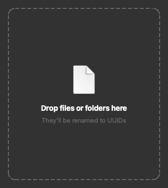
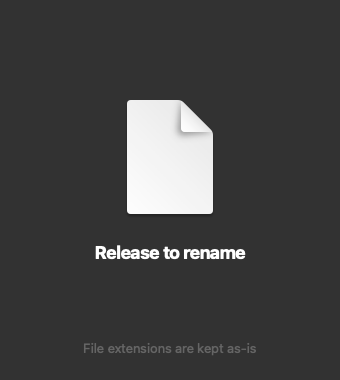

# Python Qt GUI → macOS App & Windows EXE

[](README.md)
[](README_zh-TW.md)

A minimal, end-to-end example of:

1. Building a desktop GUI application in Python with [PySide6](https://doc.qt.io/qtforpython-6/) (Qt), and
2. Packaging it as a **macOS `.app`** and a **Windows `.exe`** with [PyInstaller](https://pyinstaller.org/), including automated builds on GitHub Actions.

To have something real to package, the example is **UUID Renamer**, a small drag-and-drop tool that renames files to random UUIDs: `holiday-photo.jpg` becomes `3f2b9c1e-8d4a-4e7b-9f61-2c5d8a0b7e14.jpg`. It's deliberately small, so the GUI and packaging parts don't get buried under app logic.

<p align="center">
  
  &nbsp;&nbsp;
  
</p>

## What the example app does

- Drop files or folders onto the window. For each folder, the files directly inside it get renamed (subfolders and hidden files like `.DS_Store` are left alone).
- File extensions are kept: `report.pdf` → `<uuid>.pdf`.
- While you're dragging, the window switches to a big "Release to rename" view.
- When it's done, you get a system notification, and the old → new names show up in a log so you can still tell which file was which.

> ⚠️ There's no undo. Try it on copies first.

## Why PySide6 and not PyQt6?

Search for "Python Qt" and you'll find two libraries: **PySide6** and **PyQt6**. Both let you use the same Qt 6 framework from Python, and their APIs are almost identical. The real differences are who maintains them and how they're licensed:

| | PySide6 | PyQt6 |
|---|---|---|
| Maintained by | The Qt Company (official, a.k.a. "Qt for Python") | Riverbank Computing (third party) |
| License | LGPL (or commercial) | GPL (or commercial) |
| Code style | `Signal`, `Slot`, short enums like `Qt.AlignCenter` work | `pyqtSignal`, `pyqtSlot`, enums need full names like `Qt.AlignmentFlag.AlignCenter` |

This repo uses PySide6 for two reasons:

- **The license fits what we're doing here.** This repo is about packaging an app and handing it to other people. With PyQt6's GPL, distributing your app means you have to release its source code under the GPL too, unless you buy a commercial license. PySide6's LGPL generally lets you ship closed-source or commercial apps, as long as users can swap out the Qt libraries. PyInstaller's default output, which keeps Qt as separate library files, allows that.
- **It's the official binding.** It's developed together with Qt itself, and its docs live on [qt.io](https://doc.qt.io/qtforpython-6/).

Plenty of tutorials out there use PyQt, and that's fine. Porting their code usually means changing the imports, renaming `pyqtSignal` to `Signal`, and you're mostly done.

> This isn't legal advice. If you're shipping a commercial product, read the LGPL terms yourself. For instance, it's debatable whether a Windows `--onefile` exe, which packs Qt inside a single file, still lets users replace Qt.

## Project layout

```
.
├── app.py              # The GUI (PySide6) and notifications
├── renamer.py          # Core rename logic, no GUI. Also works as a CLI.
├── assets/icon.png     # App icon, also used for the window and notifications
├── docs/               # Screenshots for this README
├── requirements.txt
└── .github/workflows/build.yml   # Builds the .app and .exe on GitHub Actions
```

Keeping the logic in `renamer.py` separate from the GUI is deliberate. It's easy to test, and you can use it on its own:

```bash
python renamer.py photo.jpg some-folder/
```

## Run from source

You'll need Python 3.10 or newer.

```bash
python -m venv .venv
source .venv/bin/activate        # Windows: .venv\Scripts\activate
pip install -r requirements.txt
python app.py
```

## Package it as an app

PyInstaller bundles your code, the Python interpreter and every dependency into something people can double-click, with no Python install needed on their end.

One catch: **PyInstaller can't cross-compile.** It builds for the OS *and* the CPU of the machine it runs on. You need Windows to build the Windows exe and a Mac to build the macOS app, and an app built on an Apple Silicon Mac is Apple Silicon only. To get every combination without owning every kind of machine, see [Build everything with GitHub Actions](#build-everything-with-github-actions) below.

### macOS

```bash
pyinstaller --noconfirm --windowed \
  --name "UUID Renamer" \
  --icon assets/icon.png \
  --add-data "assets:assets" \
  --collect-all desktop_notifier \
  --osx-bundle-identifier com.example.uuid-renamer \
  app.py
```

You'll find the result at `dist/UUID Renamer.app`.

### Windows

```powershell
pyinstaller --noconfirm --windowed --onefile --name "UUID Renamer" --icon assets/icon.png --add-data "assets:assets" --collect-all desktop_notifier app.py
```

You'll find the result at `dist\UUID Renamer.exe`.

### What the flags do

| Flag | Why it's there |
|---|---|
| `--windowed` | Don't open a terminal window next to the app. On macOS this also produces a `.app` bundle. |
| `--onefile` | (Windows only) Pack everything into a single `.exe`. Easier to share, but it takes a few seconds to start because it unpacks itself to a temp folder first. On macOS, a `.app` is already a single thing you can drag around, so we skip this. |
| `--name` | Name of the app / exe. |
| `--icon` | App icon. PyInstaller converts the PNG to `.icns` / `.ico` for you (that's what `pillow` in `requirements.txt` is for). |
| `--add-data "assets:assets"` | Ship the `assets/` folder inside the bundle, because the app loads `icon.png` at runtime. |
| `--collect-all desktop_notifier` | `desktop-notifier` loads some of its files in a way PyInstaller can't detect. Without this flag, the packaged app crashes on launch with `No module named 'desktop_notifier.resources'`. |
| `--osx-bundle-identifier` | The app's unique ID on macOS. Change `com.example` to a domain you own. |

PyInstaller also writes a `UUID Renamer.spec` file. Once your command grows, you can edit the spec and run `pyinstaller "UUID Renamer.spec"` instead. This repo sticks to plain command-line flags so every option is visible in one place.

### Build everything with GitHub Actions

[`.github/workflows/build.yml`](.github/workflows/build.yml) runs the build on three of GitHub's machines at once, so you don't need a Windows PC, an Intel Mac or an Apple Silicon Mac of your own:

| Runner | Output | For |
|---|---|---|
| `macos-latest` | `UUID-Renamer-macOS-arm64.zip` | Macs with Apple Silicon (M1 and later) |
| `macos-15-intel` | `UUID-Renamer-macOS-x86_64.zip` | Intel Macs |
| `windows-latest` | `UUID-Renamer-Windows-x64.exe` | Windows (it also runs on ARM-based Windows PCs through emulation) |

Putting the architecture in the file name is a common convention on GitHub Releases, so people can tell which one to grab.

> `macos-15-intel` is the last Intel image GitHub offers, and it's supported until August 2027. After that you can't build the Intel version on GitHub Actions anymore. Apple is phasing out Intel Macs anyway, so that's a reasonable point to drop it.

To run it:

- **Manual run**: go to the *Actions* tab → *Build* → *Run workflow*. When it finishes, download the files from the run's *Artifacts* section. A manual run doesn't create a Release. It's handy for checking that everything still builds before you cut one.
- **Release**: push a tag that starts with `v`. That kicks off a fresh build of the tagged commit, and the files get attached to a GitHub Release automatically. Artifacts from earlier manual runs aren't reused, so you don't need to run it manually first.

  ```bash
  git tag v1.0.0
  git push origin v1.0.0
  ```

## Things you'll probably run into

### Which Mac version do I download?

Click the Apple menu → *About This Mac*. If it says *Chip: Apple M…*, get `arm64`. If it says *Processor: Intel…*, get `x86_64`. Or run `uname -m` in Terminal, which prints one or the other.

Get it wrong and macOS either refuses to open the app (an Apple Silicon build on an Intel Mac) or runs it through Rosetta, which works but is slower (an Intel build on Apple Silicon).

To ship a single app that runs natively on both, look into PyInstaller's `--target-arch universal2`. It needs a universal2 build of Python, and every package with compiled code has to provide universal2 binaries too, so it's fiddlier. That's why this repo builds them separately.

### "Unidentified developer" and SmartScreen warnings

The builds here aren't code-signed, so both operating systems will push back the first time:

- **macOS**: "UUID Renamer can't be opened because Apple cannot check it for malicious software." Go to *System Settings → Privacy & Security*, scroll down and click *Open Anyway*. Or clear the quarantine flag from the terminal:

  ```bash
  xattr -dr com.apple.quarantine "UUID Renamer.app"
  ```

- **Windows**: SmartScreen says "Windows protected your PC". Click *More info → Run anyway*.

That's fine for personal use or a demo. To ship to other people without these warnings, you need an Apple Developer ID ($99/year) to sign and notarize the macOS app, and a code signing certificate for Windows.

### Notifications on macOS

The app uses [desktop-notifier](https://github.com/samschott/desktop-notifier) for native notifications, but macOS only lets apps **signed with an Apple Developer ID** post to Notification Center. Unsigned builds get rejected, and so does running `python app.py`, which isn't an app bundle at all.

So on macOS, `app.py` checks first and falls back to AppleScript (`osascript`) when native notifications aren't allowed. The notification still shows up, just with Script Editor's icon instead of the app's. Once you sign the app, the native path kicks in on its own. Windows doesn't have this restriction.

### Other notes

- **Size**: expect around 80 MB for the macOS app, and something in the same ballpark for the Windows exe. Most of that is Qt. Installing `PySide6-Essentials` instead of the full `PySide6` keeps it smaller, since the full package adds Qt modules this app never uses (WebEngine, 3D, Multimedia, …).
